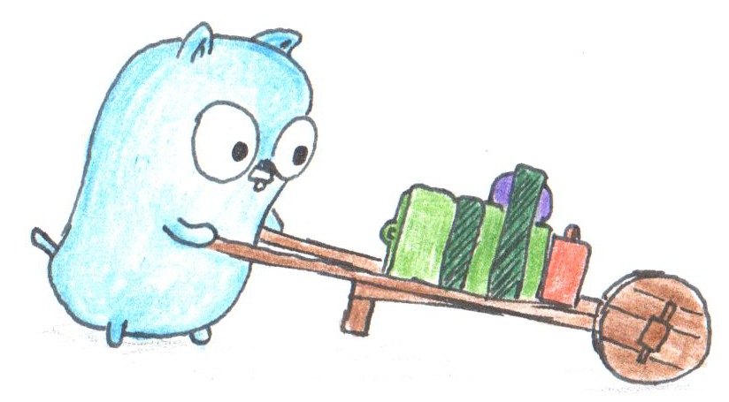

# Simple REST Services

List of simple rest services using Go programming language and some third party packages.
e.g. (`gorilla/mux`, `httprouter`, `alice`).

##  List Packages

1. [Custom Multiplexer](custommux)
   
   ServeMux is an HTTP request multiplexer, by creating a new `ServeMux` or 
   `CustomServeMux` we can handle multiple routes. With `ServeMux` we can handle
   different endpoints using a function/handler other than an if/else statement.

2. [`httprouter` library](httprouter)

    `httprouter` routes the HTTP request to particular handlers, it matches the REST methods
    such as (`GET`, `POST`, `PUT`, and so on). This library is very lightweight with fast performance.

3. [`gorilla/mux` library](gorilla)

    `gorila/mux` is a wonderful package for writing beautiful routes for web applications
    and API servers. Gorilla Mux provides tons of options to control routing such as
    path-based matching, query-base matching, domain-base matching, sub-domain base,
    and reverse URL generation.

##  Contributing

Pull requests are welcome. For major changes, please open an issue first to discuss
what you would like to change.

##  Credits

The images, svg icons and gif animations are from [Gophers](https://github.com/egonelbre/gophers)

Copyright :copyright: 2022. This project is under [CC0](LICENSE) licensed.